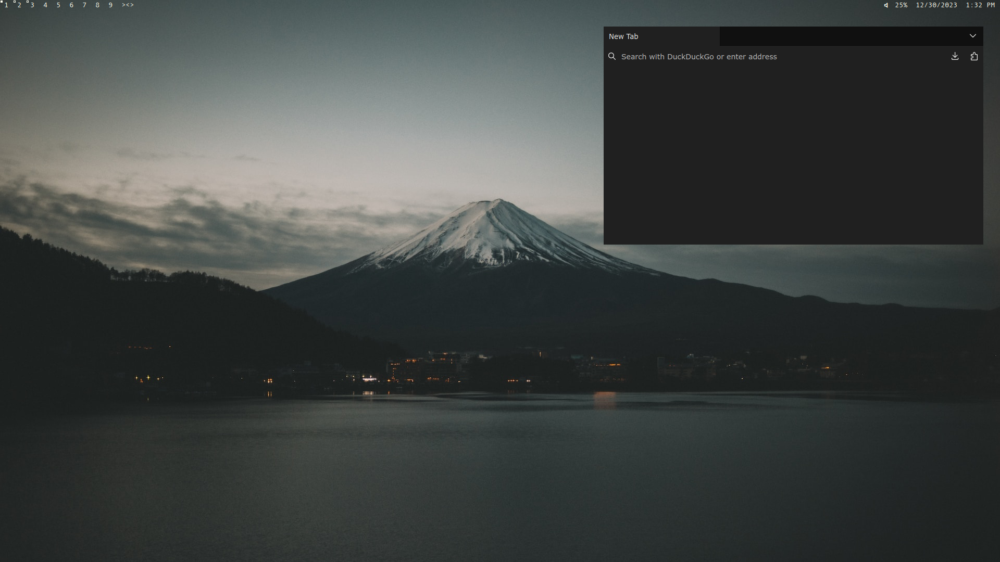

# Dot-Files

My minimalist Arch Linux configuration files

## Information

### Software
- Operating System: Arch Linux
- Window Manger: [dwm](https://github.com/alexphanna/dwm)
- Terminal Emulator: st
- Network Manager: systemd-networkd
- Internet Browser: Firefox
- Code Editor: VSCodium

### Hardware
- CPU: Ryzen 5600x
- GPU: Nvidia GeForce RTX 3060
- RAM: 16 GB
